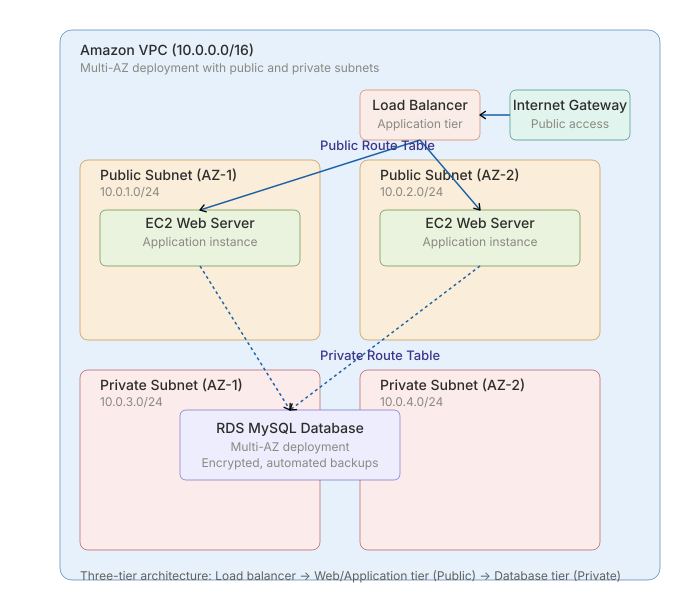

# Terraform Script for AWS 3-Tier Architecture

## Project Overview

This project demonstrates the deployment of a production-grade AWS infrastructure using Terraform. The infrastructure follows a 3-tier architecture approach with public and private subnets distributed across multiple Availability Zones for high availability and scalability.

The main goal of this project is to automate AWS infrastructure provisioning using Infrastructure as Code (IaC) Tool instead of manual console-based deployment.

---

## Services Used

* Amazon VPC
* Public and Private Subnets
* Internet Gateway
* Route Tables
* EC2 Instance
* RDS MySQL Database
* Application Load Balancer (ALB)
* Security Groups
* Terraform

---

## Architecture Design

The infrastructure consists of:

* A custom VPC
* Two public subnets for web/application traffic
* Two private subnets for database layer isolation
* Internet Gateway for public internet access
* Public and Private route tables
* EC2 instance deployed in public subnet
* RDS database deployed in private subnets
* Application Load Balancer for distributing traffic

This setup follows a basic production-ready cloud networking model.

---

## Terraform Files

| File Name   | Purpose                                          |
| ----------- | ------------------------------------------------ |
| provider.tf | AWS provider configuration                       |
| main.tf     | Main infrastructure resources                    |
| output.tf   | Outputs generated after deployment               |
| .gitignore  | Prevents sensitive/state files from being pushed |

---

## Deployment Steps

### Initialize Terraform

```bash
terraform init
```

### Format Terraform Files

```bash
terraform fmt
```

### Validate Configuration

```bash
terraform validate
```

### Preview Infrastructure

```bash
terraform plan
```

### Deploy Infrastructure

```bash
terraform apply
```

---

## Outputs

After successful deployment, Terraform provides:

* VPC ID
* Public Subnet IDs
* Private Subnet IDs
* EC2 Public IP
* RDS Endpoint
* ALB DNS Name

---

## Key Learnings

Through this project, I practiced:

* AWS networking concepts
* Infrastructure as Code (IaC)
* Terraform resource dependencies
* Multi-AZ architecture design
* Load Balancer configuration
* Public and private subnet routing
* Troubleshooting of Terraform issues

---

## Future Improvements

Some enhancements that can be added later:

* Auto Scaling Group
* NAT Gateway
* Terraform Modules
* Remote Backend using S3
* CI/CD Integration
* Monitoring with CloudWatch

---

